# Module 14 Challenge - Machine Learning Trading Bot


## Overview

For this challenge I am developing an algorithmic trading bot to enhance the existing trading signals, currently utilized by a top financial advisory firm, with machine learning algorithms. This will give the firm a competitive advantage in a highly dynamic industry where the ability to adapt to new data is paramount. 

## Dataset

The data was provided in `csv` format with over 4,300 rows of MSCI-based ("Morgan Stanley Capital International") investment data for emerging markets.

The dataset includes the following OHLCV fields:
* date
* open
* high
* low
* close
* volume

## Libraries and Dependencies

The [notebook](machine_learning_trading_bot.ipynb) loads the following libraries and dependencies.

```python
# Imports
import pandas as pd
import numpy as np
from pathlib import Path
import hvplot.pandas
import matplotlib.pyplot as plt
from sklearn import svm
from sklearn.preprocessing import StandardScaler
from pandas.tseries.offsets import DateOffset
from sklearn.metrics import classification_report

import warnings
warnings.filterwarnings("ignore")
```
## Machine Learning Models and Tuning

### Support Vector Machine (SVM) Model (scv classifier)

| Plot            | Classification Report            |
|--------------------|--------------------|
| 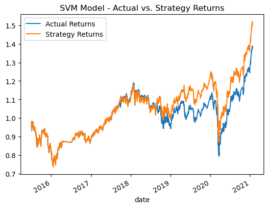 | 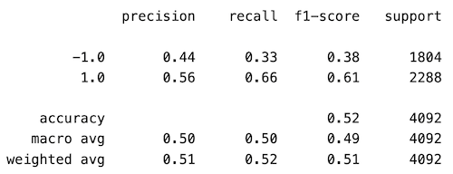 |

### Model Tuning 1 - Training Window Adjustments

| 1 Month            | 6 Month            |
|--------------------|--------------------|
| 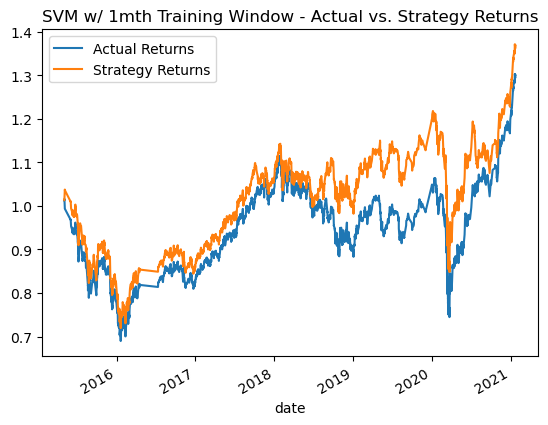 | 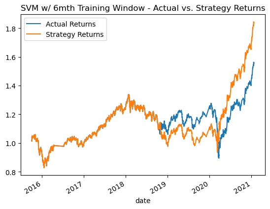 |
| 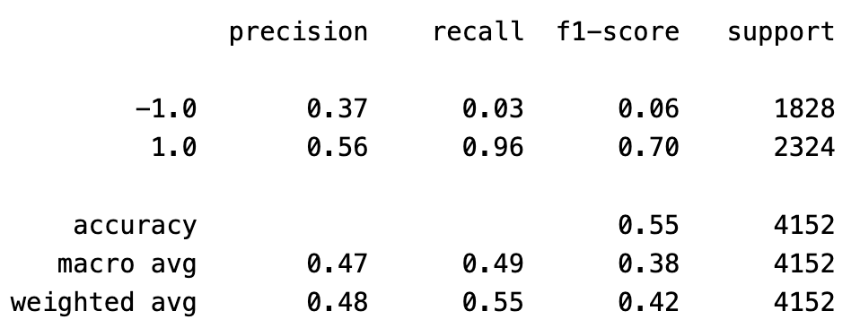 | 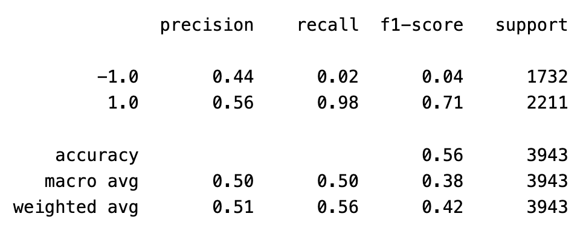 |

QUESTION - What impact resulted from increasing or decreasing the training window?

ANSWER - **Decreasing the training window to one month** with the SVM model had a slight impact on the strategy returns, taking them from approximately 1.5 (50%) to a little under 1.4 (appx. 45%) over the study period.

**Increasing the training window to six months** had a significant impact on the strategy returns, taking them to a little over 1.8 (80%).

### Model Tuning 2 - Short SMA (Simple Moving Average) Input Features

| 2 Days*            | 10 Days*            |
|--------------------|--------------------|
| 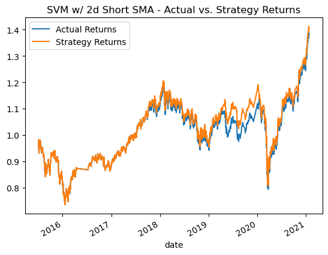 | 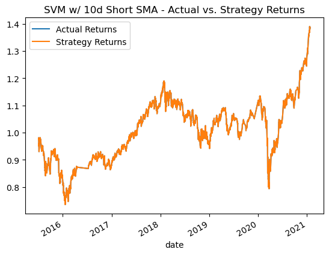 |
| 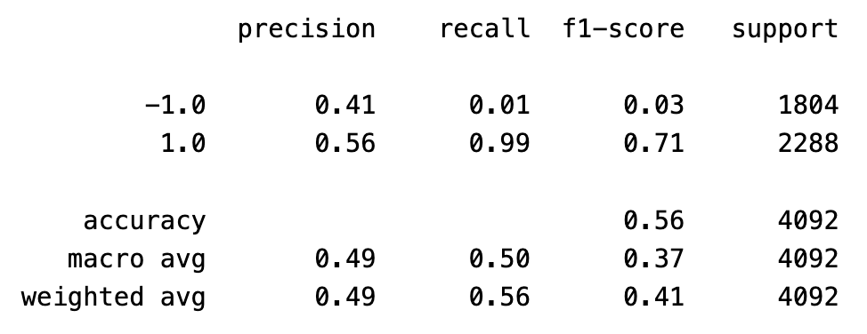 | 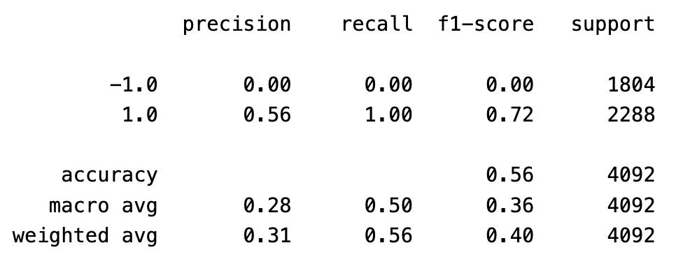 |

*Note: "Days" are actually 15 minute periods.*

QUESTION - What impact resulted from increasing and decreasing the Short SMA window?

ANSWER - **Decreasing and increasing the short SMA window** caused the strategy and actual returns to line up very closely, showing little difference and coming in at at a lower return level. 

### Model Tuning 3 - Long SMA (Simple Moving Average) Input Features

| 50 Days*            | 200 Days*            |
|--------------------|--------------------|
| 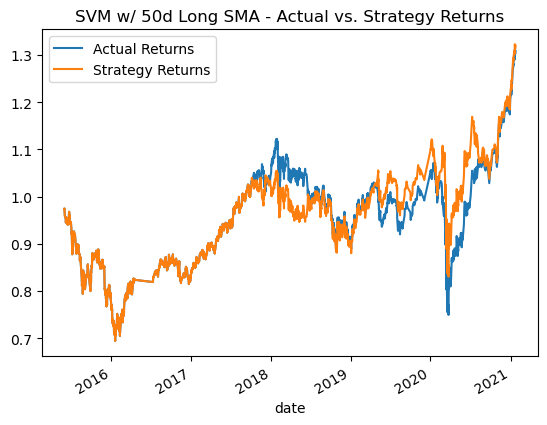 | 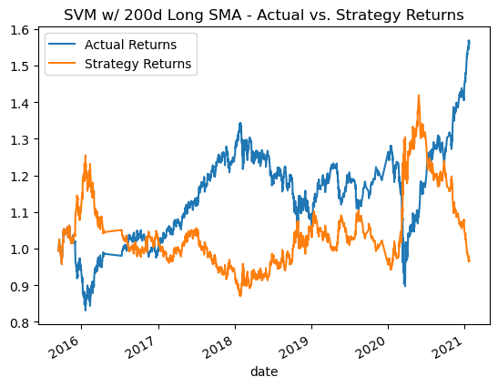 |
| 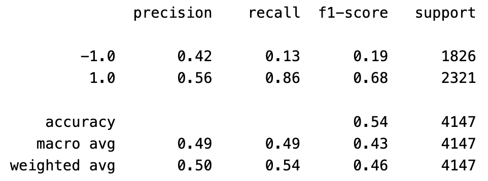 | 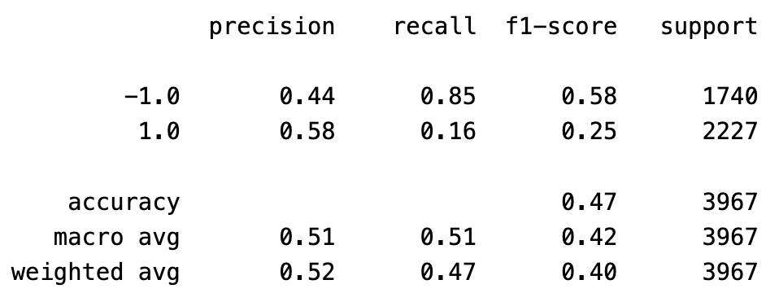 |

*Note: "Days" are actually 15 minute periods.*

QUESTION - What impact resulted from increasing and decreasing the Long SMA window?

ANSWER - **Decreasing and increasing the long SMA window** did not have a favorable impact on the returns outcome but did change the classification results significantly, as shown above. 

### Logistic Regression (LR) Model


| Plot            | Classification Report            |
|--------------------|--------------------|
| 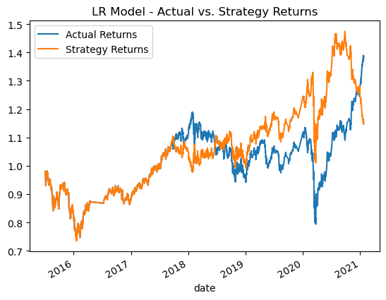 |  |

## Summary

The SVM model with a 6-month training window produced the highest strategy returns at approximately 1.825 (82.5%). The logistic regression model did not produce a favorable outcome, causing the strategy returns to reverse trend in the final year of the test period, ending at approximately 1.15 (15%) over the subject period. 

To continue tuning the results I address the fact that SMAs were set errantly to 15 min periods rather than days in the source file pseudocoding. I would explore actual 50, 100, 200 day SMAs for performance optimization. Also, additional machine learning classifiers such as `AdaBoost` and `DecisionTreeClassifier` should be examined for impact. 

## Sources

The following sources were consulted in the completion of this project. 

* [pandas.Pydata.org API Reference](https://pandas.pydata.org/docs/reference/index.html)
* [scikit-learn documentation](https://scikit-learn.org/stable/)
* UCB FinTech Bootcamp instructor-led coding exercises